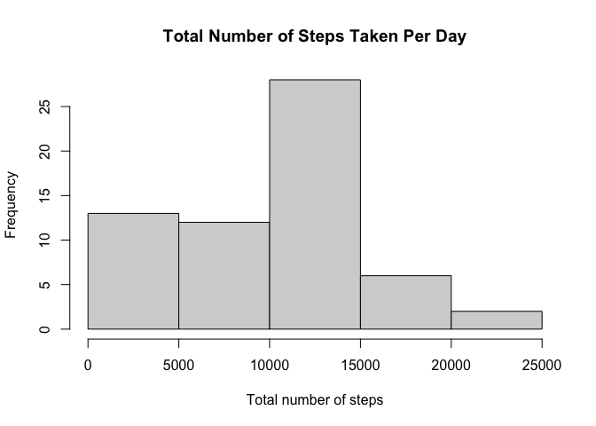
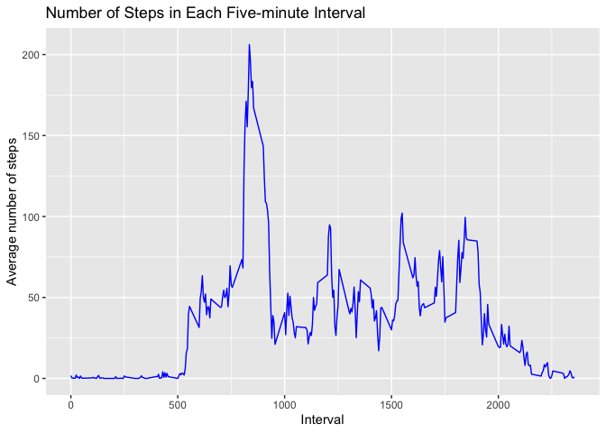
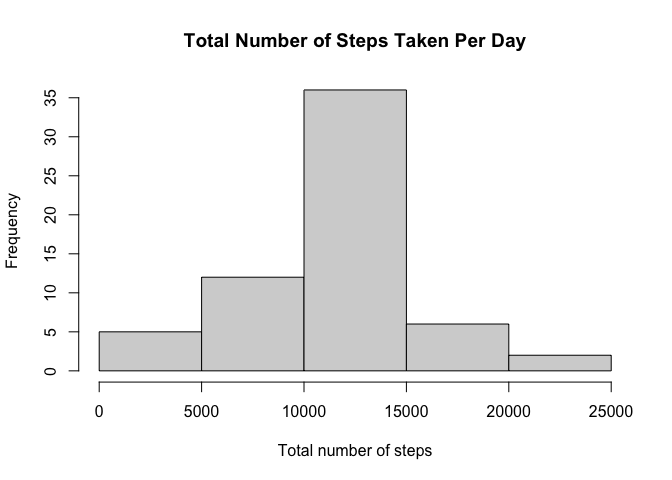
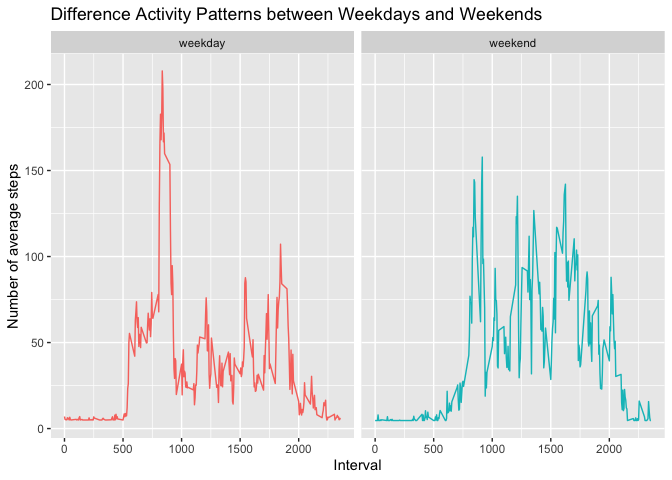

## Loading and preprocessing the data

```r
library(tidyverse)
```

```
## ── Attaching packages ─────────────────────────────────────── tidyverse 1.3.1 ──
```

```
## ✓ ggplot2 3.3.3     ✓ purrr   0.3.4
## ✓ tibble  3.1.1     ✓ dplyr   1.0.6
## ✓ tidyr   1.1.3     ✓ stringr 1.4.0
## ✓ readr   1.4.0     ✓ forcats 0.5.1
```

```
## ── Conflicts ────────────────────────────────────────── tidyverse_conflicts() ──
## x dplyr::filter() masks stats::filter()
## x dplyr::lag()    masks stats::lag()
```

```r
library(Hmisc)
```

```
## Loading required package: lattice
```

```
## Loading required package: survival
```

```
## Loading required package: Formula
```

```
## 
## Attaching package: 'Hmisc'
```

```
## The following objects are masked from 'package:dplyr':
## 
##     src, summarize
```

```
## The following objects are masked from 'package:base':
## 
##     format.pval, units
```

```r
if(!file.exists('activity.csv')){
        unzip('activity.zip')
}
dat <- read.csv("activity.csv")

dat$date <- as.Date(as.character(dat$date), "%Y-%m-%d") #change date from chr to date format 
```


## What is mean total number of steps taken per day?

```r
#steps grouped by date and sum calculated
totalsteps <- dat %>% 
        select(steps, date) %>%
        group_by(date) %>%
        summarise(tsteps = sum(steps, na.rm = T))

hist(totalsteps$tsteps, main = "Total Number of Steps Taken Per Day", xlab = "Total number of steps")
```

<!-- -->

```r
meantsteps <- mean(totalsteps$tsteps, na.rm = T)
mediantsteps <- median(totalsteps$tsteps, na.rm = T)
```

The mean of the total number of steps taken per day is 9354.2295082 and the medain is 10395.

## What is the average daily activity pattern?

```r
#steps grouped by interval and mean for each interval calculated
avgsteps5 <- dat %>%
        select(steps, interval) %>%
        group_by(interval) %>%
        summarise(avgsteps = mean(steps, na.rm = T))

ggplot(avgsteps5, aes(x=interval, y=avgsteps))+
        geom_line(col="blue")+
        labs(x = "Interval", y = "Average number of steps", title = "Number of Steps in Each Five-minute Interval")
```

<!-- -->

```r
int <- avgsteps5[which.max(avgsteps5$avgsteps),] #identify row number with max number of average steps
maxsteps <- int$interval
maxsteps
```

```
## [1] 835
```
The five-minute interval that contains the maximum number of steps is 835 (i.e. 8:35am).

## Imputing missing values

```r
incomplete <- dat[!complete.cases(dat),] #rows with missing values
missing <- nrow(incomplete) #number of rows with missing values
```
The total number of missing values in the dataset (i.e. the total number of rows with NAs) is 2304.


```r
imputeddat <- dat
imputeddat$steps <- impute(imputeddat$steps, fun = mean) #missing values for "steps" were filled in with the mean value

#check missing values in other variables
length(which(is.na(imputeddat$steps)))
```

```
## [1] 0
```

```r
length(which(is.na(imputeddat$interval)))
```

```
## [1] 0
```

```r
length(which(is.na(imputeddat$date)))
```

```
## [1] 0
```

```r
#No missing values left

newdat <- imputeddat #new dataset created with missing values filled in

#steps grouped by date and total calculated
totalstepsnew <- newdat %>% 
        select(steps, date) %>%
        group_by(date) %>%
        summarise(tstepsnew = sum(steps))

hist(totalstepsnew$tstepsnew, main = "Total Number of Steps Taken Per Day", xlab = "Total number of steps")
```

<!-- -->

```r
meannew <- mean(totalstepsnew$tstepsnew)
mediannew <- median(totalstepsnew$tstepsnew)

meandiff <- meannew - meantsteps
mediandiff <- mediannew - mediantsteps
```
The mean of total number of steps taken per day is 1.0766189\times 10^{4} and the median is 1.0766189\times 10^{4}.
The new mean and median values are different the estimates that were done before imputing missing data.
The new mean value is 1411.959171 greater and the new median is 371.1886792 greater than the previous respective estimates.


## Are there differences in activity patterns between weekdays and weekends?

```r
#to create a new variable "days" (as factor) - weekdays or weekends
newdat$days <- ifelse((weekdays(newdat$date) == "Saturday") | (weekdays(newdat$date) =="Sunday"), "weekend", "weekday")
newdat$days <- as.factor(newdat$days)

#steps grouped by interval and days(weekdays/weekends) and average steps calculated
avgstepsdays <- newdat %>%
        select(steps, interval, days) %>%
        group_by(interval,days) %>%
        summarise(avgstepsd = mean(steps, na.rm = T))
```

```
## `summarise()` has grouped output by 'interval'. You can override using the `.groups` argument.
```

```r
ggplot(avgstepsdays, aes(x=interval, y=avgstepsd, col = days))+
        geom_line()+
        facet_grid(cols = vars(days))+
        theme(legend.position="none")+
        labs(x = "Interval", y = "Number of average steps", title = "Difference Activity Patterns between Weekdays and Weekends")
```

<!-- -->
